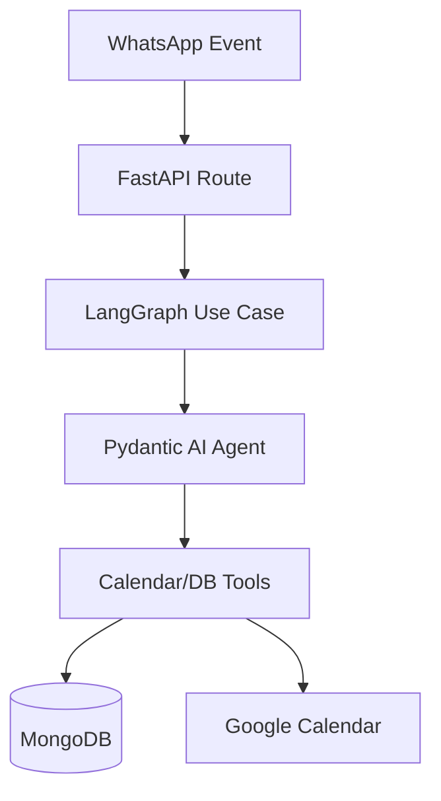

# Arquitetura Técnica - Amon Claw (SDR & Scheduler)

## Visão Geral
O **Amon Claw** é um sistema multi-agêntico de SDR e Agendamento focado em pequenos negócios. Ele utiliza LangGraph para orquestração de diálogos e Pydantic AI para execução de ferramentas determinísticas.

## Estrutura de Pastas (Clean Architecture)

1. **Presentation (API/Handlers)** -> Pontos de entrada (FastAPI) para Webhooks (WhatsApp/Evolution).
2. **Application (Use Cases)** -> Orquestração do LangGraph, lógica de agendamento e fluxos de SDR.
3. **Domain (Entities/Interfaces)** -> Definição de regras de negócio, entidades (Tenant, Appointment, Professional) e contratos.
4. **Infrastructure** -> Implementações de persistência (MongoDB), integração com APIs externas (Google Calendar, Evolution API) e serviços AWS.

## Decisões Arquiteturais Principais

- **Multi-Tenancy:** Estratégia de *Shared Database/Shared Schema* usando MongoDB.
- **Orquestração:** LangGraph para gerenciar o estado da conversa entre nós de processamento.
- **Integração de Agenda:** Sincronização bidirecional com Google Calendar API.

## Mapa Mental do Fluxo

## Infraestrutura (AWS Serverless)
- **AWS Lambda:** Execução da lógica de negócio.
- **ECR:** Armazenamento das imagens Docker para as Lambdas.
- **DynamoDB/MongoDB:** Persistência de dados e estado.
- **Secret Manager:** Gestão de chaves de API.
