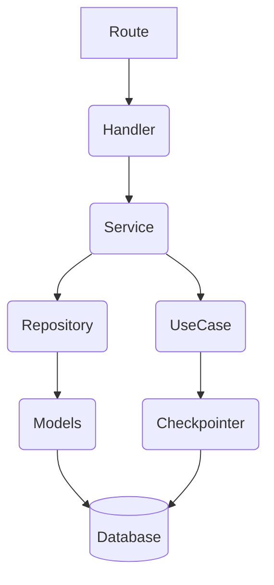

# Arquitetura técnica

## Estrutura de pastas

### Clean Archtecture 

1. **Handlers** -> Valida no presentation.
2. **Routes** -> Rotas FastAPI.
3. **Repository** -> Persistência.
4. **UseCase** -> Grafos langgraph e Micro-Agents pydantic ai.
5. **DTO** -> Contrato entre classes.
6. **Services** -> Faz o trabalho pesado.
7. **Schemas** -> Validação de requests, serialização de response, serialização de output dos micro-agents pydantic ai.
8. **Models** -> Tabelas Banco de dados.
9. **Settings** -> Config aninhada com pydantic

### Mapa Mental

---

## Infraestrutura

### AWS SAM - serveless first

- Lambda Function
- ECR
- API Gateway
- Dynamo DB
- OpenSearch (para RAG)
- Bedrock
- IAM
- Secret Manager
