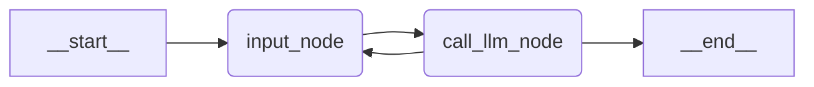
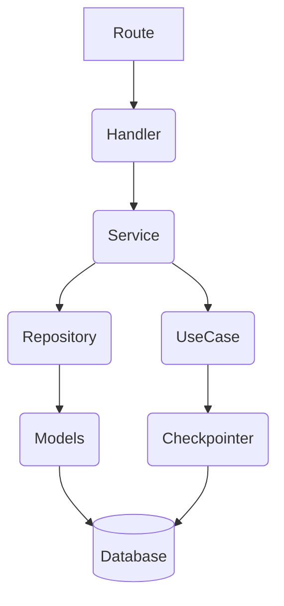

# Amon Claw

O **Amon Claw** é um sistema multi-agêntico focado em realizar e ajudar em tarefas manuais do Matheus Amon(eu kkkk). O foco é hiper-personalização e cada linha de código é escrito manualmente, o uso de LLMs no desenvolvimento esta sendo apenas para discussão lógica e decisões tecnológicas.

Stack:
- Langgraph -> Criação de Workflows determinísticos e orquestração de tarefas.
- FastAPI -> exposição em uma interface HTTP para webhooks

Integrações:
- Inicialmente apenas Openrouter como provedor de API de LLM mas restringido apenas para modelos free, o foco é ter SML disponiveis para fazer tarefas determinísticas e não dar proatividade pros agentes.

Current graph:


Target graph:


---

Aplicação: 


---

## Como Rodar Localmente (Developer Experience)

O projeto suporta dois fluxos de execução para rodar localmente, focados em agilidade e demonstrações.

### 1. Workflow Dev (Desenvolvimento Diário)
Para quem vai codar e precisa de hot-reload instantâneo:
- Suba apenas os bancos de dados/infra:
  ```bash
  docker compose up -d
  ```
- Rode a API localmente via `uv` (a aplicação lerá o seu `.env`):
  ```bash
  uv run uvicorn amon_claw.presentation.api.app:app --reload --port 8080
  ```

### 2. Workflow PoC (Produção Local / "Blackbox")
Para apresentar o sistema ou testar a imagem final exatamente como irá rodar na AWS Lambda:
- Suba todos os serviços (Bancos + App):
  ```bash
  docker compose -f compose.prod.yml up --build -d
  ```
