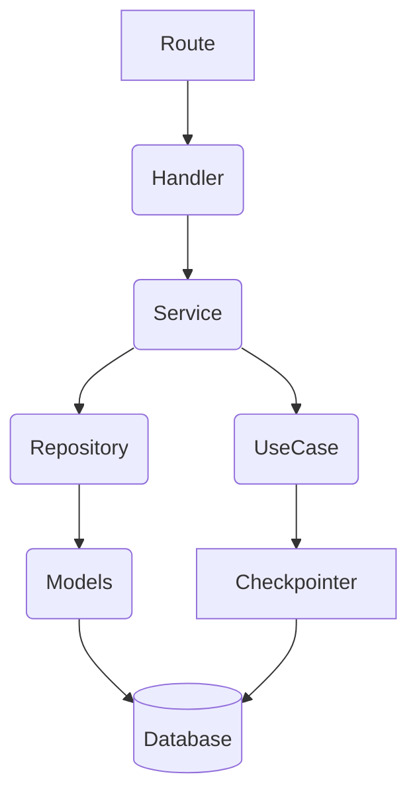

# Amon Claw

[](https://github.com/matheus-amon/amon-claw/actions/workflows/ci.yml)
[](https://codecov.io/gh/matheus-amon/amon-claw)
[](https://matheus-amon.github.io/amon-claw/)
[](LICENSE)

A personal multi-agent system for automating the repetitive parts of my own
workflow. The design goal is hyper-personalisation with **deterministic
execution**: the code is hand-written, and LLMs are used only as a discussion
partner for logic and technology decisions — never as the thing silently
deciding what runs.

## Design

Agents are modelled as explicit graphs rather than free-running loops. Control
flow is a state machine, so every run is inspectable, replayable and
checkpointed.

```
__start__ → input_node → call_llm_node → input_node
                             ↓
                          __end__
```

**Stack**

- **LangGraph** — deterministic workflow graphs and task orchestration.
- **FastAPI** — HTTP surface for webhooks and external triggers.

**LLM access** is initially routed through OpenRouter, restricted to free
models. The intent is to keep small models available for deterministic
subtasks and deliberately withhold proactivity from the agents — they ask,
they don't initiate.

## Application architecture

Clean-architecture layering, with the graph state threaded through it:


```mermaid
flowchart TD
    A[Route] --> B(Handler)
    B --> C(Service)
    C --> D(UseCase)
    C --> E(Repository)
    E --> F(Models)
    D --> G[Checkpointer]
    F --> H@{ shape: cyl, label: "Database" }
    G --> H
```

## Running locally

Two workflows, depending on whether you are writing code or demonstrating the
system.

### 1. Dev workflow (day-to-day)

Hot reload for the API, with only the datastores running in Docker:

```bash
docker compose up -d
uv run uvicorn amon_claw.presentation.api.app:app --reload --port 8080
```

### 2. PoC workflow (blackbox)

Full stack — datastores plus the app, built exactly as it will run:

```bash
docker compose -f compose.prod.yml up --build -d
```

## Documentation

Architecture notes and reference material live in [`docs/`](docs/), published
via MkDocs (`mkdocs.yml`).
